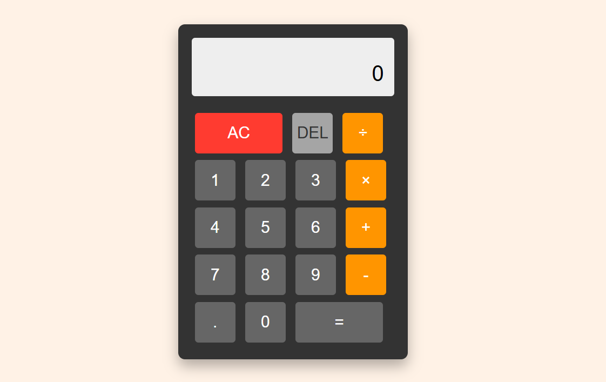

# 🎨🧮 Color-Changing Calculator

A stylish and interactive web-based calculator that not only performs basic arithmetic operations, but also changes its background color every 30 seconds to enhance user experience. Built using **HTML**, **CSS**, and **JavaScript**.

 <!-- Add a screenshot if available -->

---

## 🌟 Features

- Basic calculator functions: addition, subtraction, multiplication, division
- Decimal input and deletion
- Clear and reset functionality
- Dynamic UI with hover and active states
- Automatically changes background color every 30 seconds from a pastel palette
- Responsive and mobile-friendly design

---

## 🚀 Demo

[Live Demo](https://tikesh-sahu-git.github.io/calculator-/)  
*(https://tikesh-sahu-git.github.io/calculator-/)*

---

## 🛠️ Technologies Used

- HTML5
- CSS3 (Flexbox, transitions)
- Vanilla JavaScript (ES6+)

---

## 📁 Project Structure

color-changing-calculator/
│
├── index.html # Main HTML file
├── style.css # (Inline styles in HTML; can be separated)
├── script.js # (Embedded script; handles calculator logic and color change)
├── screenshot.png # (Optional preview image)
└── README.md # Project documentation

---

## 🧠 How It Works

- Calculator logic is handled by a `Calculator` class managing inputs, operations, and display updates.
- Button inputs are connected via `data-*` attributes.
- Background color changes every 30 seconds using a timer and a predefined palette of soft colors.
- Transitions are applied for smooth visual effects.

---

## 🧩 Future Enhancements

- Keyboard input support
- Dark mode toggle or adaptive color themes
- Memory functions (M+, M-, MR)
- Enhanced error handling (e.g., division by zero)
- Persisting background color using localStorage

---

